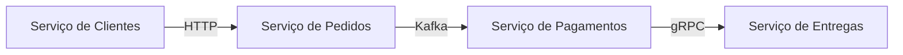
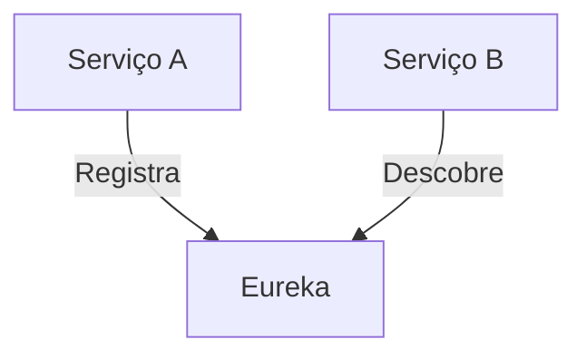
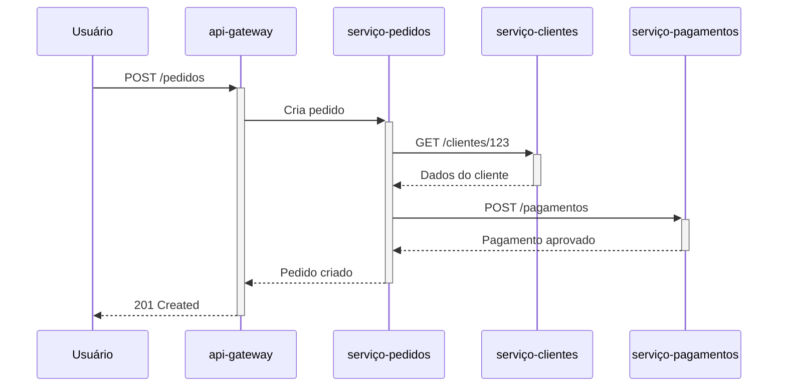

# 🏗️ Arquitetura de Microserviços: O Bairro de Casinhas Inteligentes

Vamos imaginar que construir um sistema é como planejar uma cidade! 🌆

## 🌈 O que são Microserviços?

Pense em microserviços como um **bairro de casinhas** independentes, onde:

- Cada casinha faz **UMA** coisa muito bem
- Todas se comunicam por cartinhas (mensagens)
- Se uma pegar fogo 🔥, as outras continuam de pé

### Comparação com Monolito (Modo Antigo)
```plaintext
[PRÉDIO GIGANTE]
├─ Andar 1: Vendas
├─ Andar 2: Pagamentos
└─ Andar 3: Entregas
```
**Problema**: Se o elevador quebra, ninguém trabalha!

## 🧩 Por que Microserviços?

1. **Escala melhor**: Posso ter 10 casinhas de vendas e só 2 de pagamentos
2. **Falhas isoladas**: Se o serviço de email cair, as vendas continuam
3. **Times independentes**: Cada equipe cuida de uma casinha

## 🏠 Componentes Básicos

### 1. Serviços Especializados


### 2. Comunicação
- **HTTP/REST** (Cartinhas simples)
- **gRPC** (Telefone digital rápido)
- **Kafka** (Quadro de avisos compartilhado)

### 3. Banco de Dados
Cada serviço tem **seu próprio banco**!
```plaintext
Serviço A → Banco PostgreSQL
Serviço B → Banco MongoDB
Serviço C → Banco Redis
```

## ⚔️ Monolito vs Microserviços

### Monolito (Anos 2000)
```java
// Tudo no mesmo projeto!
@Controller
public class MegaController {
    
    @Autowired
    private ClienteDAO clienteDAO;
    
    @Autowired
    private PedidoDAO pedidoDAO;
    
    public void processarTudo() {
        // 500 linhas de código misturando:
        // - Regras de cliente
        // - Cálculo de pedidos
        // - Integração com pagamento
    }
}
```

### Microserviços (Moderno)
```java
// Serviço 1: Clientes (projeto separado)
@RestController
public class ClienteController {
    @GetMapping("/{id}")
    public Cliente buscarCliente(@PathVariable Long id) {
        return clienteRepository.findById(id);
    }
}

// Serviço 2: Pedidos (outro projeto)
@RestController
public class PedidoController {
    @PostMapping
    public ResponseEntity<?> criarPedido(@RequestBody PedidoDTO dto) {
        // Chama Serviço de Cliente via HTTP
        Cliente cliente = clienteService.buscar(dto.clienteId());
        // Lógica específica de pedidos
    }
}
```

## 🛠️ Tecnologias Modernas

### 1. Spring Cloud
```java
@SpringBootApplication
@EnableDiscoveryClient  // Registra no servidor de nomes
public class ClienteApplication {
    public static void main(String[] args) {
        SpringApplication.run(ClienteApplication.class, args);
    }
}
```

### 2. Docker e Kubernetes
```dockerfile
# Dockerfile de cada serviço
FROM openjdk:17
COPY target/cliente-service.jar app.jar
ENTRYPOINT ["java","-jar","/app.jar"]
```

### 3. API Gateway (Spring Cloud Gateway)
```yaml
# application.yml
spring:
  cloud:
    gateway:
      routes:
      - id: cliente-service
        uri: lb://cliente-service
        predicates:
        - Path=/api/clientes/**
```

## 🧠 Padrões Importantes

### 1. Circuit Breaker
```java
@RestController
@DefaultProperties(defaultFallback = "fallbackMethod")
public class PedidoController {
    
    @GetMapping("/com-detelhes")
    @CircuitBreaker(name = "clienteService")
    public PedidoDetalhado buscarComDetalhes() {
        // Se cliente-service falhar, chama fallback
    }
    
    public PedidoDetalhado fallbackMethod() {
        return new PedidoDetalhado("Dados temporariamente indisponíveis");
    }
}
```

### 2. Service Discovery


### 3. Config Server
```plaintext
Todos serviços buscam configurações num lugar central:
config-server/
├─ application.yml
├─ cliente-service.yml
└─ pedido-service.yml
```

## 🎯 Exemplo Prático: E-commerce

### Arquitetura:
```plaintext
1. 🏠 serviço-clientes: Gerencia cadastros (Java + PostgreSQL)
2. 🏠 serviço-catalogo: Produtos e categorias (Kotlin + MongoDB)
3. 🏠 serviço-pedidos: Processa compras (Java + Kafka)
4. 🏠 serviço-pagamentos: Integra com gateways (Go + Redis)
5. 🚪 api-gateway: Entrada única (Spring Cloud Gateway)
```

### Comunicação:


## 💡 Dicas para Iniciantes

1. **Comece simples**: 2-3 microsserviços essenciais
2. **Use Spring Boot**: Facilita muito a criação
3. **Containerize**: Docker desde o início
4. **Monitore**: Prometheus + Grafana
5. **Erros comuns**:
   - Criar microserviços muito pequenos (nanosserviços)
   - Comunicação excessiva entre serviços
   - Banco de dados compartilhado

Lembre-se: microserviços são como times esportivos - cada jogador tem uma posição definida, mas todos trabalham juntos para vencer o jogo! ⚽🏆