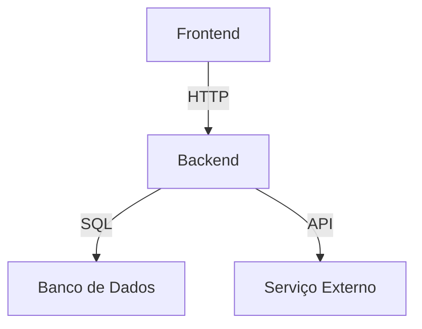
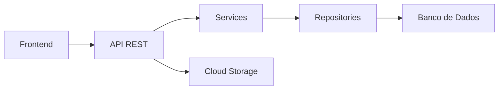

# 🏗️ Arquitetura de Software: O Lego dos Programadores

Vamos imaginar que construir software é como montar um castelo de Lego! 🏰

## 🌈 O que é Arquitetura de Software?

É o **plano de construção** que diz:
- Quais peças (partes do sistema) vamos usar
- Como elas se encaixam
- Quem pode mexer em cada parte
- Como tudo conversa junto

### Exemplo sem Arquitetura (Bagunça):
```plaintext
[Seu código] → [Banco de dados]
 ↑      ↓
[Outro código] ← [Mais código]
```
(Tudo misturado - se uma peça quebra, tudo cai!)

### Exemplo com Arquitetura (Organizado):


## 🧩 Os 3 Tipos Principais (Como Casas)

### 1. Casa Tijolo (Monolito) - Modo Antigo
- Tudo numa só construção
- Fácil de fazer no começo
- Problema: Se crescer, fica pesado

```java
// Tudo junto: Model + Controller + Regras de Negócio
public class PedidoServlet extends HttpServlet {
    protected void doPost(...) {
        // 1. Valida dados
        // 2. Calcula preço
        // 3. Salva no banco
        // 4. Envia email
    }
}
```

### 2. Conjunto de Casinhas (Microserviços) - Modo Moderno
- Cada função é uma casinha separada
- Pode crescer sem problemas
- Mais difícil de construir

```java
// Serviço 1: Pedidos
@RestController
public class PedidoController {
    @Autowired
    private EmailService emailService;
    
    @PostMapping
    public void criarPedido() {
        // Chama outros serviços via HTTP
    }
}

// Serviço 2: Pagamentos (outra aplicação)
@RestController
public class PagamentoController {
    @PostMapping
    public void processarPagamento() { ... }
}
```

### 3. Apartamento (Camadas) - O Meio Termo
```plaintext
Andar 3: Apresentação (Frontend)
Andar 2: Negócios (Regras)
Andar 1: Armazenamento (Banco de Dados)
```

## 🏆 As 5 Regras de Ouro da Boa Arquitetura

1. **Separação de Interesses**: Cada parte faz UMA coisa bem
   - ❌ Errado: Uma classe que manda email E calcula impostos
   - ✅ Certo: `EmailService` + `CalculadoraImpostos`

2. **Baixo Acoplamento**: Partes não grudam umas nas outras
   ```java
   // Certo: Interface permite trocar implementação
   interface RepositorioClientes {
       void salvar(Cliente c);
   }
   
   // Errado: Dependência direta do banco
   class ClienteDAO {
       private MySQLConnection conn;
   }
   ```

3. **Alta Coesão**: Partes relacionadas ficam juntas
   - Todos métodos de pagamento na classe `PagamentoService`
   - Não espalhar lógica de pagamento em 10 classes diferentes

4. **Princípio da Menor Surpresa**: Nomes que fazem sentido
   - `CalculadoraImpostos.calcularIRPF()` - Bom!
   - `ServicoFinanceiro.fazerCoisa()` - Ruim!

5. **DRY (Don't Repeat Yourself)**: Não repetir código
   - Criar `DateUtils.formatarData()` em vez de copiar formatação em 20 lugares

## ⚔️ Arcaico vs Moderno

### Sem Tecnologia (Anos 80)
```plaintext
[Programa Gigante]
 ├─ [Tela]
 ├─ [Regras]
 └─ [Dados]
```
- Tudo junto
- Dificílimo de mudar
- Quebra fácil

### Com Tecnologia Moderna (Spring Boot)


## 🧠 Padrões Arquiteturais Famosos

### 1. MVC (Model-View-Controller) - Como uma Lanchonete
- **Garçom (Controller)**: Recebe pedidos
- **Cozinha (Model)**: Prepara os dados
- **Prato (View)**: Mostra o resultado

```java
// Model
@Entity
public class Produto { ... }

// Controller
@Controller
public class LojaController {
    @GetMapping
    public String listar(Model model) {
        model.addAttribute("produtos", produtoService.listar());
        return "lista";
    }
}

// View (Thymeleaf)
<html>
   <li th:each="p : ${produtos}" th:text="${p.nome}">
```

### 2. Clean Architecture - Como Cebola 🧅
```plaintext
        [ Regras de Negócio ]
          ↑           ↑
[ Interfaces ]   [ Implementações ]
          ↑
     [ Frameworks ]
```

### 3. Hexagonal - Como Favos de Mel 🐝
```plaintext
      [ Núcleo ]
    ↗     ↑     ↖
[API]  [Banco]  [UI]
```

## 🏗️ Exemplo Prático: Evolução Arquitetural

### Fase 1: Início (Tudo Junto)
```java
public class Aplicacao {
    public static void main(String[] args) {
        // 1. Pedir dados do usuário
        // 2. Calcular resultados
        // 3. Mostrar na tela
        // 4. Salvar no arquivo
    }
}
```

### Fase 2: Separando em Camadas
```java
// Camada de Apresentação
public class TelaUsuario {
    public void mostrar() { ... }
}

// Camada de Negócio
public class Calculadora {
    public BigDecimal calcular() { ... }
}

// Camada de Dados
public class Armazenamento {
    public void salvar() { ... }
}
```

### Fase 3: Arquitetura Profissional (Spring)
```java
@RestController  // Camada Web
public class MeuController {
    @Autowired
    private MeuService service;  // Injeção de dependência
    
    @GetMapping
    public ResponseEntity<?> endpoint() {
        return ResponseEntity.ok(service.regraDeNegocio());
    }
}

@Service  // Camada de Negócio
public class MeuService {
    @Autowired
    private MeuRepository repo;
    
    public Dto regraDeNegocio() {
        // Lógica complexa aqui
        return repo.buscarDados();
    }
}

@Repository  // Camada de Dados
public interface MeuRepository extends JpaRepository<Entidade, Long> {}
```

## 🎯 Dicas para Aprender

1. Comece com **MVC** (o mais simples)
2. Depois experimente **Clean Architecture**
3. Quando estiver avançado, tente **Hexagonal**
4. Pratique refatorando:
   - Pegue um código "tudo junto" e separe em camadas
   - Exemplo: Extrair lógica de banco de dados para uma classe separada

Lembre-se: boa arquitetura é como construir com Lego - quanto melhor organizadas as peças, mais alto e estável seu castelo ficará! 🏰✨