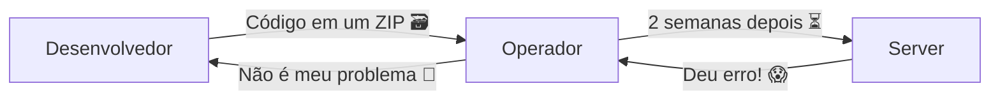
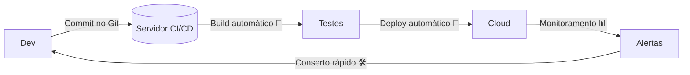

# 🚀 **DevOps: A Fábrica Mágica de Software** (Explicação para Iniciantes)

Imagine que criar um app é como fazer um bolo de aniversário! 🎂 DevOps é a **cozinha super moderna** onde os chefs (desenvolvedores) e os entregadores (operadores) trabalham juntos para fazer e entregar bolos **rápido e sem bagunça**.

## 🌈 **O que é DevOps?**
É um **jeito inteligente** de:
1. **Criar** programas (como apps e sites)
2. **Testar** para ver se tudo funciona
3. **Entregar** para as pessoas usarem
4. **Consertar** se der problema

Tudo isso **automaticamente**, como uma linha de montagem de carros! 🚗💨

---

## 🏭 **Modo Antigo vs. Moderno**

### **Era das Trevas (Antigamente)**

**Problemas:**
- Demorava MESES para entregar
- Ninguém sabia por que quebrava
- Todo mundo brigava 😠

### **Era Moderna (DevOps)**

**Mágica:**
- Entrega em **HORAS** ou **MINUTOS** ⏱️
- Erros são descobertos **antes** de quebrar
- Todo mundo colabora 🤝

---

## 🛠️ **Ferramentas Mágicas do DevOps**

### 1. **Git (Livro de Receitas Digital)**
Guarda todas as versões do seu código:
```bash
git add .  # Guarda as mudanças
git commit -m "Adicionei botão"  # Coloca no livro
git push  # Envia para a nuvem
```

### 2. **Jenkins (Robô Faz-Tudo)**
```groovy
pipeline {
    agent any
    stages {
        stage('Build') {  # Constrói o app
            steps {
                sh 'mvn package'
            }
        }
        stage('Test') {  # Testa automaticamente
            steps {
                sh 'mvn test'
            }
        }
    }
}
```

### 3. **Docker (Caixinhas Mágicas)**
Empacota seu app com TUDO que ele precisa:
```dockerfile
FROM openjdk:17  # Java 17
COPY target/app.jar app.jar  # Seu app
CMD ["java", "-jar", "app.jar"]  # Comando para rodar
```

### 4. **Kubernetes (Chefe das Caixinhas)**
Gerencia milhares de containers ao mesmo tempo:
```yaml
apiVersion: apps/v1
kind: Deployment
metadata:
  name: meu-app
spec:
  replicas: 3  # 3 cópias do seu app
  template:
    spec:
      containers:
      - name: app
        image: meu-app:1.0
```

---

## 🔍 **Exemplo Real: App de Notas**

### **Sem DevOps:**
1. Você programa por 1 mês 📅
2. Envia por email para um amigo testar 📧
3. Ele diz: _"Não abre no meu PC!"_ 😫
4. Você tenta adivinhar o problema 🔮

### **Com DevOps:**
1. Você programa e envia para o Git 💾
2. **Automagicamente**:
   - O app é testado ✅
   - Empacotado em Docker 🐳
   - Publicado na nuvem ☁️
3. Seu amigo acessa **instantaneamente** 🌐
4. Se der erro, o sistema **avisa sozinho** 📱

---

## 🧩 **Princípios do DevOps (Regras de Ouro)**

1. **Automação Tudo!** 🤖  
   - Nada de clicar 100 vezes para publicar

2. **Monitoramento 24/7** 👀  
   - Saber se o app está doente antes dos usuários

3. **Infraestrutura como Código** 📜  
   - Servidores descritos em arquivos (não configurados manualmente)

4. **Entrega Contínua** 🚚  
   - Novas versões todo dia (ou até toda hora!)

---

## 🎯 **Como Começar? (Passo a Passo)**

1. **Instale o Git** e aprenda comandos básicos
2. **Crie uma conta no GitHub** (é de graça!)
3. **Experimente Jenkins** ou GitHub Actions
4. **Brincade com Docker** (rode um MySQL em 1 comando)
5. **Suba um app simples** para a nuvem (Heroku é fácil)

```bash
# Exemplo: Rodar MySQL com Docker
docker run --name meu-banco -e MYSQL_ROOT_PASSWORD=12345 -d mysql:8.0
```

---

## 💡 **Dica Final**
DevOps é como andar de bicicleta 🚴‍♂️:  
- No começo parece difícil  
- Depois que aprende, não quer mais parar!  
- E **acelera MUITO** seu trabalho!

Quer ver um exemplo **real** de pipeline DevOps para Java? Posso te mostrar um passo a passo completo! 😊