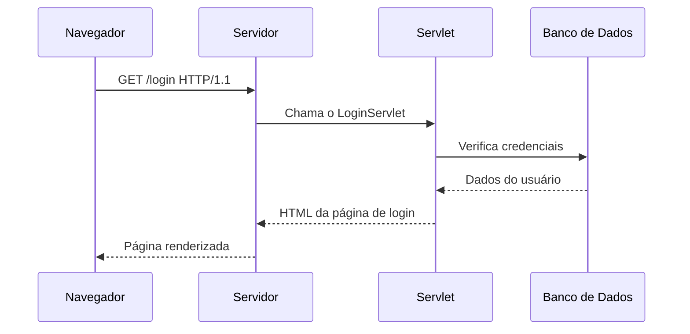
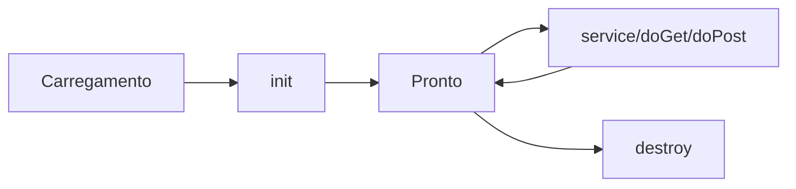

# 🎻 Servlets Java: O Guia Completo para Iniciantes  

Olá, pequeno(a) programador(a)! Hoje vamos aprender sobre **Servlets**, que são como "atendentes mágicos" que trabalham nos bastidores dos sites para entregar páginas web dinâmicas. Vou explicar **tudo** desde o básico, com exemplos e comparações!  

---  

## 📜 **1. O Que é um Servlet?**  
Um **Servlet** é um programa Java que roda em um **servidor web** (como Tomcat ou Jetty) e responde a pedidos da internet (HTTP).  

- **Antigamente**: Sem Servlets, os sites eram estáticos (só mostravam o mesmo conteúdo para todo mundo).  
- **Com Servlets**: Podemos criar páginas que mudam conforme o usuário (ex.: login, carrinho de compras).  

### 🌍 **Exemplo do Mundo Real**  
Imagine uma lanchonete:  
- **Sem Servlet**: Só tem um cardápio fixo na parede (site estático).  
- **Com Servlet**: O garçom (Servlet) pergunta o que você quer, vai à cozinha (servidor) e traz seu pedido personalizado (página dinâmica).  

---  

## 🏗️ **2. Como um Servlet Funciona?**  
Quando você digita uma URL (ex.: `www.loja.com/login`), acontece isto:  

1. **Navegador** → Envia pedido HTTP ("Quero a página de login!").  
2. **Servidor** → Recebe e passa para o **Servlet** correspondente.  
3. **Servlet** → Processa (ex.: verifica usuário/senha no banco de dados).  
4. **Servlet** → Responde com HTML ("Aqui está sua página personalizada!").  



---  

## ⚙️ **3. Criando um Servlet (Passo a Passo)**  

### 🔹 **Modo Tradicional (Arcaico) - Interface `Servlet`**  
Antes do Java EE, era mais trabalhoso:  

```java
import javax.servlet.*;
import java.io.IOException;

public class MeuPrimeiroServlet implements Servlet {
    @Override
    public void init(ServletConfig config) throws ServletException {
        System.out.println("Servlet iniciado!");
    }

    @Override
    public void service(ServletRequest req, ServletResponse res) 
            throws IOException, ServletException {
        res.getWriter().println("<h1>Olá, mundo Servlet!</h1>");
    }

    @Override
    public void destroy() {
        System.out.println("Servlet destruído!");
    }

    // Métodos não usados (antigo)
    @Override public ServletConfig getServletConfig() { return null; }
    @Override public String getServletInfo() { return null; }
}
```  
**Problema**: Muito código repetitivo.  

---  

### 🔹 **Modo Moderno - Classe `HttpServlet`**  
Hoje usamos `HttpServlet`, que já implementa métodos úteis:  

```java
import javax.servlet.http.*;
import javax.servlet.annotation.*;
import java.io.IOException;

@WebServlet("/ola")  // Define a URL do Servlet
public class OlaServlet extends HttpServlet {
    @Override
    protected void doGet(HttpServletRequest req, HttpServletResponse resp) 
            throws IOException {
        resp.getWriter().println("<h1>Olá, GET!</h1>");
    }

    @Override
    protected void doPost(HttpServletRequest req, HttpServletResponse resp) 
            throws IOException {
        resp.getWriter().println("<h1>Olá, POST!</h1>");
    }
}
```  
**Vantagens**:  
- Mais simples (só implementar `doGet`, `doPost`).  
- Anotação `@WebServlet` evita configuração manual no `web.xml`.  

---  

## 📜 **4. Servlet vs. Tecnologias Modernas (JSP, Spring Boot)**  

### 🔄 **Servlets Puros (Antigo)**  
- **Vantagem**: Total controle sobre HTTP.  
- **Desvantagem**: Escrever HTML no Java é chato (`resp.getWriter().println("<html>...")`).  

### 🖥️ **JSP (JavaServer Pages - Evolução)**  
Permite misturar HTML + Java (mas ainda é antigo):  
```jsp
<%@ page contentType="text/html;charset=UTF-8" %>
<html>
<body>
    <h1>Olá, <%= request.getParameter("nome") %>!</h1>
</body>
</html>
```  

### 🚀 **Spring Boot (Moderno)**  
Usa Servlets por baixo, mas esconde a complexidade:  
```java
@RestController
public class OlaController {
    @GetMapping("/ola")
    public String ola() {
        return "Olá, Spring Boot!";
    }
}
```  
**Diferença**:  
- No Spring, você **não mexe diretamente** em `HttpServletRequest`/`Response` (a menos que precise).  
- Servlets são a **base**, mas frameworks modernos simplificam.  

---  

## 🧩 **5. Ciclo de Vida de um Servlet**  
Todo Servlet passa por estas fases:  

1. **`init()`**: Chamado uma vez quando o Servlet é carregado.  
2. **`service()`**: Chamado a cada requisição (que chama `doGet`, `doPost`).  
3. **`destroy()`**: Chamado quando o servidor desliga.  



---  

## 🏆 **6. Quando Usar Servlets Hoje?**  
- Se você está **aprendendo** como a web funciona por baixo dos panos.  
- Se precisa de **controle fino** sobre HTTP (ex.: API customizada).  
- Se trabalha em sistemas legados (antigos).  

Para projetos novos, prefira **Spring Boot** ou **Jakarta EE**.  

---  

## 📚 **7. Resumo Final**  
| **Era**       | **Tecnologia**  | **Vantagem**                     | **Desvantagem**               |
|---------------|----------------|----------------------------------|-------------------------------|
| Anos 2000     | Servlet Puro   | Controle total                   | Complexo                      |
| Anos 2010     | JSP            | HTML + Java fácil                | Mistura lógica e visual       |
| Hoje          | Spring Boot    | Rápido e moderno                 | Esconde detalhes do Servlet   |

---  

## 🚀 **Mão na Massa!**  
Que tal criar seu primeiro Servlet?  

1. Baixe o **Apache Tomcat** (servidor).  
2. Crie um projeto Java Web no Eclipse/IntelliJ.  
3. Copie o código do `OlaServlet` acima.  
4. Acesse: `http://localhost:8080/seu-projeto/ola`  

Pronto! Você já é um **mestre dos Servlets**! 🎉  

Quer aprender mais? Pergunte sobre:  
- Como usar `HttpServletRequest` e `HttpServletResponse`.  
- Como configurar Servlets no `web.xml` (modo antigo).  
- Como integrar com bancos de dados.  

👉 **Bora codar!** 💻