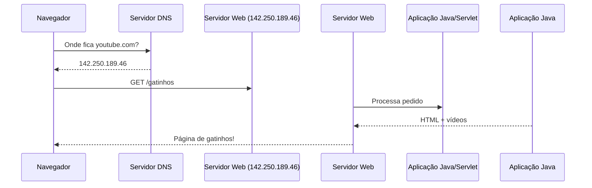

# 🌍 **Servidor Web: O Guia Definitivo para Iniciantes**  

Olá, futuro(a) mestre da internet! Hoje vamos explorar o **servidor web**, que é como o **coração invisível** da internet. Ele é responsável por entregar sites, vídeos, jogos e tudo o que você vê online. Vou explicar **tudo** desde o começo, com exemplos e comparações!  

---  

## 🏰 **1. O Que é um Servidor Web?**  
Um **servidor web** é um computador superpoderoso (ou programa) que **armazena e entrega páginas da internet** quando alguém as solicita.  

### 🌎 **Exemplo do Mundo Real**  
Imagine uma **biblioteca**:  
- **Sem servidor**: Você só lê livros que já estão na sua estante (offline).  
- **Com servidor**: Você pede um livro ao bibliotecário (servidor), que busca na estante certa e entrega para você (página web).  

---  

## 🔧 **2. Como um Servidor Web Funciona?**  
Quando você digita `www.youtube.com` no navegador:  

1. **Navegador** → Envia um pedido: *"Quero assistir a vídeos de gatinhos!"*  
2. **Servidor DNS** → Traduz `youtube.com` para um **IP** (como `142.250.189.46`).  
3. **Servidor Web** → Recebe o pedido e decide o que fazer:  
   - Se for um arquivo estático (ex.: imagem, HTML), envia direto.  
   - Se for dinâmico (ex.: login), passa para um **programa** (como um Servlet).  
4. **Resposta** → O servidor envia a página pronta de volta.  



---  

## 🕰️ **3. Evolução dos Servidores Web**  

### 🏺 **Modo Arcaico (Anos 90) – Servidores Estáticos**  
- **Exemplos**: Apache 1.0, servidores só para arquivos HTML.  
- **Como funcionava**:  
  - Se você pedisse `site.com/sobre.html`, o servidor enviava o arquivo **exatamente como estava**.  
  - **Problema**: Não dava para personalizar (todos viam a mesma coisa).  

### ⚡ **Modo Dinâmico (Anos 2000) – Servidores + Programas**  
- **Novidade**: Servidores passaram a rodar programas (CGI, Servlets, PHP).  
  - Ex.: `site.com/login` → Chamava um **Servlet** para verificar o usuário.  
- **Tecnologias**:  
  - **Apache + Tomcat** (para Java).  
  - **PHP + MySQL** (para sites como WordPress).  

### 🚀 **Modo Moderno (Hoje) – Cloud e Microserviços**  
- **Servidores viraram "nuvens"**: AWS, Google Cloud, Azure.  
- **Múltiplos servidores trabalhando juntos**:  
  - Um para o site, outro para o banco de dados, outro para vídeos.  
- **Tecnologias**:  
  - **NGINX** (mais rápido que Apache para sites modernos).  
  - **Spring Boot** (cria servidores embutidos, sem precisar do Tomcat).  

---  

## ⚖️ **4. Servidor Web vs. Servidor de Aplicação**  

| **Servidor Web**            | **Servidor de Aplicação**       |  
|-----------------------------|---------------------------------|  
| Entrega arquivos (HTML, CSS). | Roda programas (Java, PHP).     |  
| Ex.: Apache, NGINX.          | Ex.: Tomcat, WildFly.           |  
| **Rápido para conteúdo estático**. | **Poderoso para lógica complexa**. |  

💡 **Curiosidade**: Hoje, muitos servidores fazem os dois (ex.: **Tomcat** é um servidor web **e** de aplicação).  

---  

## 🛠️ **5. Principais Servidores Web**  

### a) **Apache HTTP Server** (Antigo, mas ainda usado)  
- **Prós**: Estável, compatível com tudo.  
- **Contras**: Mais lento que o NGINX para muitos usuários.  

### b) **NGINX** (Moderno e eficiente)  
- **Prós**:  
  - Usado por Netflix, Airbnb.  
  - Melhor para sites com **muitas conexões ao mesmo tempo**.  
- **Contras**: Configuração mais complexa.  

### c) **Servidor Embarcado (Spring Boot)**  
- **Prós**:  
  - Não precisa de Tomcat instalado (já vem dentro do app).  
  - Perfeito para microsserviços.  
- **Exemplo**:  
  ```java
  @SpringBootApplication
  public class MeuServidorWeb {
      public static void main(String[] args) {
          SpringApplication.run(MeuServidorWeb.class, args); // Servidor embutido!
      }
  }
  ```

---  

## 📜 **6. Como um Servidor Web Lida com Requisições?**  

### 🔄 **Fluxo Detalhado**:  
1. **Recebe o pedido** (ex.: `GET /produtos`).  
2. **Decide o que fazer**:  
   - Se for um arquivo (`/style.css`), envia direto.  
   - Se for uma rota (`/login`), passa para o **backend** (Java, Node.js).  
3. **Gera a resposta** (HTML, JSON, erro 404).  
4. **Envia de volta** ao navegador.  

### ⚙️ **Exemplo de Configuração (Apache vs. NGINX)**  

#### **Apache (arquivo `.htaccess`)**:  
```apache
# Redireciona /blog para WordPress
RewriteEngine On
RewriteRule ^blog/?$ /wordpress/index.php [L]
```  

#### **NGINX (arquivo `nginx.conf`)**:  
```nginx
server {
    listen 80;
    location /blog {
        proxy_pass http://wordpress;
    }
}
```  

---  

## 🌟 **7. Como Criar um Servidor Web em Java?**  

### a) **Modo Tradicional (Tomcat)**  
1. Baixe o [Apache Tomcat](https://tomcat.apache.org/).  
2. Coloque seu `.war` (app Java) na pasta `webapps`.  
3. Rode `startup.bat` (Windows) ou `startup.sh` (Linux).  

### b) **Modo Moderno (Spring Boot)**  
```java
@RestController
public class MeuServidor {
    @GetMapping("/ola")
    public String ola() {
        return "Servidor rodando! 🚀";
    }
}
```  
- **Basta rodar**: O Spring usa um **servidor embutido** (Tomcat, Jetty ou Netty).  

---  

## 🏆 **8. Resumo: Ontem vs. Hoje**  

| **Era**       | **Tecnologia**       | **Como Funcionava**                     |  
|--------------|----------------------|----------------------------------------|  
| Anos 90      | Apache + HTML estático | Servia arquivos sem personalização.    |  
| Anos 2000    | Tomcat + Servlets    | Páginas dinâmicas com Java.             |  
| 2010+        | NGINX + Spring Boot  | Sites rápidos + apps em nuvem.          |  

---  

## 🚀 **Mão na Massa!**  
Que tal criar seu próprio servidor?  

### **Opção 1 (Simples) – Python**  
```python
# Crie um servidor em 3 linhas!
python -m http.server 8000
```  
Acesse: `http://localhost:8000`  

### **Opção 2 (Java) – Spring Boot**  
1. Crie um projeto no [Spring Initializr](https://start.spring.io/).  
2. Adicione `Spring Web`.  
3. Rode e acesse `http://localhost:8080`.  

Pronto! Você já tem um **servidor web** rodando! 🎉  

---  

## 📚 **Para Saber Mais**  
- **O que é HTTP/HTTPS?** → Protocolo que o servidor usa para se comunicar.  
- **O que é um Load Balancer?** → Distribui tráfego entre vários servidores.  
- **O que é Docker?** → Empacota servidores em "containers".  

Quer mergulhar em algum tema? É só pedir! 👇 😊