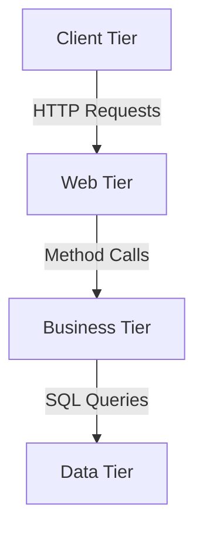

# Tiers e Layers: Explicação Detalhada para Iniciantes em Java

## Introdução: Organizando seu Código

Quando desenvolvemos aplicações Java (especialmente enterprise), é crucial organizar o código em partes lógicas. Dois conceitos fundamentais para essa organização são **Tiers** (Camadas Físicas) e **Layers** (Camadas Lógicas).

## 1. Layers (Camadas Lógicas)

São divisões **conceituais** do seu código, baseadas em responsabilidades. Funcionam como "caixinhas" que separam diferentes tipos de lógica.

### Principais Layers em uma Aplicação Java:

#### a) Presentation Layer (Camada de Apresentação)
- **O que faz**: Lida com a interação usuário-sistema
- **Tecnologias típicas**:
  - Spring MVC Controllers
  - JSF (JavaServer Faces)
  - JSP/Thymeleaf
- **Exemplo**:
```java
@Controller
public class ClienteController {
    @GetMapping("/clientes")
    public String listarClientes(Model model) {
        // Chama a camada de serviço
        List<Cliente> clientes = clienteService.listarTodos();
        model.addAttribute("clientes", clientes);
        return "lista-clientes";
    }
}
```

#### b) Business Layer (Camada de Negócios)
- **O que faz**: Contém as regras de negócio da aplicação
- **Onde fica**: Classes de serviço (Service)
- **Características**:
  - Conhece as regras do domínio
  - Coordena operações entre múltiplos repositórios
- **Exemplo**:
```java
@Service
public class ClienteService {
    
    @Autowired
    private ClienteRepository repository;
    
    public void cadastrarCliente(Cliente cliente) {
        if (cliente.getNome() == null || cliente.getNome().isEmpty()) {
            throw new RegraNegocioException("Nome é obrigatório");
        }
        repository.salvar(cliente);
    }
}
```

#### c) Persistence Layer (Camada de Persistência)
- **O que faz**: Lida com armazenamento e recuperação de dados
- **Tecnologias**:
  - JDBC
  - JPA (Hibernate)
  - Spring Data JPA
- **Exemplo**:
```java
@Repository
public interface ClienteRepository extends JpaRepository<Cliente, Long> {
    List<Cliente> findByNomeContaining(String nome);
}
```

#### d) Domain Layer (Camada de Domínio)
- **O que faz**: Contém as entidades e objetos de valor do seu negócio
- **Exemplo**:
```java
@Entity
public class Cliente {
    @Id
    @GeneratedValue
    private Long id;
    private String nome;
    private String email;
    // getters, setters, etc.
}
```

### Benefícios das Layers:
- **Separação de preocupações**: Cada parte tem uma responsabilidade clara
- **Facilidade de manutenção**: Mudanças em uma layer afetam minimamente as outras
- **Testabilidade**: Pode testar cada parte isoladamente
- **Reuso**: Business logic pode ser reutilizada em diferentes interfaces

## 2. Tiers (Camadas Físicas)

São divisões **físicas** da aplicação, que podem rodar em máquinas/servidores diferentes.

### Tiers Comuns:

#### a) Client Tier (Camada do Cliente)
- **O que é**: Onde a interface do usuário roda
- **Exemplos**:
  - Navegador web
  - Aplicativo móvel
  - Desktop application

#### b) Web Tier (Camada Web)
- **O que é**: Servidor que processa requisições HTTP
- **Exemplos**:
  - Tomcat
  - Jetty
  - Servidores que rodam Spring MVC

#### c) Business Tier (Camada de Negócios)
- **O que é**: Onde a lógica de negócios é executada
- **Em aplicações simples**: Pode estar no mesmo servidor que a Web Tier
- **Em sistemas complexos**: Servidores separados (EJB containers, etc.)

#### d) Data Tier (Camada de Dados)
- **O que é**: Onde os dados são armazenados
- **Exemplos**:
  - Bancos de dados (MySQL, PostgreSQL)
  - Sistemas de armazenamento em nuvem

### Arquitetura 3-Tier (Muito Comum)

1. **Apresentação**: Browser ou aplicativo
2. **Lógica**: Servidor de aplicação (Java)
3. **Dados**: Banco de dados



## Diferença Chave: Tiers vs Layers

| Aspecto        | Layers                          | Tiers                          |
|----------------|---------------------------------|--------------------------------|
| Natureza       | Lógica (organização do código)  | Física (deploy/execução)       |
| Comunicação    | Chamadas de método              | Network protocols (HTTP, RMI)  |
| Localização    | Podem estar no mesmo processo   | Geralmente em máquinas diferentes |
| Exemplo        | Controller → Service → Repository | Browser → Tomcat → MySQL      |

## Padrão de Arquitetura Típico em Spring Boot

Em muitas aplicações Spring Boot modernas (especialmente microsserviços), temos:

1. **Camadas Lógicas** (Layers) separadas no código
2. **Camadas Físicas** (Tiers) geralmente condensadas em um único servidor

```java
// Domain Layer
@Entity
public class Produto { /* ... */ }

// Persistence Layer
@Repository
public interface ProdutoRepository extends JpaRepository<Produto, Long> {}

// Business Layer
@Service
public class ProdutoService {
    @Autowired
    private ProdutoRepository repository;
    
    public List<Produto> listarDisponiveis() {
        return repository.findByDisponivelTrue();
    }
}

// Presentation Layer
@RestController
@RequestMapping("/api/produtos")
public class ProdutoController {
    @Autowired
    private ProdutoService service;
    
    @GetMapping
    public List<Produto> listar() {
        return service.listarDisponiveis();
    }
}
```

## Boas Práticas

1. **Nunca misture responsabilidades**:
   - Controller não deve acessar o banco diretamente
   - Service não deve gerar HTML
   - Entities não devem conter lógica de negócios complexa

2. **Direção das dependências**:
   - Controllers dependem de Services
   - Services dependem de Repositories
   - Nunca o contrário!

3. **Exceções**:
   - Trate exceções técnicas na camada adequada
   - Ex: `@ControllerAdvice` para tratamento na presentation layer

4. **DTOs (Data Transfer Objects)**:
   - Use objetos específicos para comunicação entre layers
   - Evite expor suas entidades diretamente

## Exercício Prático

Imagine um sistema de biblioteca:

1. **Domain Layer**:
```java
@Entity
public class Livro {
    @Id
    private String isbn;
    private String titulo;
    private boolean emprestado;
}
```

2. **Persistence Layer**:
```java
@Repository
public interface LivroRepository extends JpaRepository<Livro, String> {
    List<Livro> findByEmprestadoFalse();
}
```

3. **Business Layer**:
```java
@Service
public class BibliotecaService {
    @Autowired
    private LivroRepository repository;
    
    public void emprestarLivro(String isbn) {
        Livro livro = repository.findById(isbn)
            .orElseThrow(() -> new LivroNaoEncontradoException(isbn));
        
        if (livro.isEmprestado()) {
            throw new LivroIndisponivelException(isbn);
        }
        
        livro.setEmprestado(true);
        repository.save(livro);
    }
}
```

4. **Presentation Layer**:
```java
@RestController
@RequestMapping("/api/livros")
public class BibliotecaController {
    @Autowired
    private BibliotecaService service;
    
    @PostMapping("/{isbn}/emprestar")
    public ResponseEntity<String> emprestar(@PathVariable String isbn) {
        service.emprestarLivro(isbn);
        return ResponseEntity.ok("Livro emprestado com sucesso");
    }
}
```

## Evoluindo sua Arquitetura

Conforme sua aplicação cresce, você pode:

1. Separar **Tiers** fisicamente:
   - Banco de dados em servidor separado
   - Serviços em containers Docker distintos

2. Adicionar mais **Layers**:
   - Camada de integração (para APIs externas)
   - Camada de segurança
   - Camada de cache

3. Implementar **Clean Architecture** ou **Hexagonal Architecture**:
   - Onde as camadas de domínio ficam no centro
   - Camadas externas (como banco de dados) são "plugáveis"

Lembre-se: comece simples com uma separação clara entre Presentation, Business e Persistence layers, e evolua conforme a necessidade!