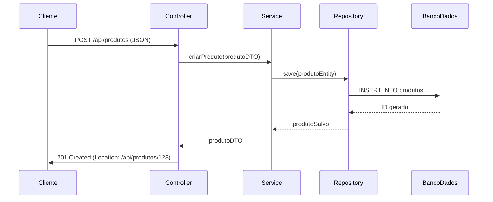

# Explicação Detalhada sobre Beans, Componentes e APIs REST em Java

Vamos explorar profundamente cada um desses conceitos fundamentais no ecossistema Java.

## 1. Beans em Java

### Definição Completa
Beans são objetos Java que seguem um conjunto específico de convenções de design. Eles representam um padrão de componente reutilizável na plataforma Java.

### Características Essenciais
1. **Propriedades Privadas**: Todas as variáveis de instância são declaradas como `private`
2. **Getters e Setters Públicos**: Para cada propriedade, há métodos públicos de acesso
3. **Construtor Padrão**: Sempre possui um construtor sem argumentos
4. **Serializável**: Geralmente implementam `java.io.Serializable` (embora não obrigatório)

### Exemplo Expandido
```java
import java.io.Serializable;

public class Produto implements Serializable {
    private static final long serialVersionUID = 1L;
    
    private Long id;
    private String nome;
    private Double preco;
    private Integer quantidadeEstoque;

    // Construtor padrão (obrigatório)
    public Produto() {
    }

    // Construtor com parâmetros (opcional)
    public Produto(Long id, String nome, Double preco) {
        this.id = id;
        this.nome = nome;
        this.preco = preco;
    }

    // Getters e Setters para todas as propriedades
    public Long getId() {
        return id;
    }

    public void setId(Long id) {
        this.id = id;
    }

    // ... outros getters e setters

    // Método adicional de negócio (opcional)
    public boolean temEstoque() {
        return quantidadeEstoque != null && quantidadeEstoque > 0;
    }

    // Sobrescrita de toString (recomendado)
    @Override
    public String toString() {
        return "Produto [id=" + id + ", nome=" + nome + ", preco=" + preco + "]";
    }
}
```

### Uso Prático
```java
Produto p = new Produto();
p.setId(1L);
p.setNome("Smartphone");
p.setPreco(1999.90);
System.out.println(p.getNome()); // Imprime "Smartphone"
```

## 2. Componentes em Java (Contexto Spring)

### Definição Aprofundada
Componentes são classes Java gerenciadas pelo container Spring (ou outro framework DI/IoC). Eles formam a base da arquitetura modular em aplicações Spring.

### Hierarquia de Anotações de Componente
1. **`@Component`**: Anotação base para qualquer componente Spring
2. **`@Service`**: Especialização para camada de serviço/lógica de negócio
3. **`@Repository`**: Para classes de acesso a dados (DAO)
4. **`@Controller`**/`@RestController`: Para classes controladoras web

### Ciclo de Vida de um Componente
1. **Detecção**: Durante a inicialização, Spring varre o classpath
2. **Instanciação**: Cria instâncias dos componentes
3. **Injeção de Dependências**: Resolve e injeta dependências
4. **Pós-processamento**: Executa callbacks como `@PostConstruct`
5. **Disponibilização**: Fica pronto para uso na aplicação

### Exemplo Detalhado
```java
import org.springframework.stereotype.Service;
import org.springframework.transaction.annotation.Transactional;

@Service
@Transactional
public class ProdutoService {
    
    private final ProdutoRepository produtoRepository;
    
    // Injeção via construtor (recomendado)
    public ProdutoService(ProdutoRepository produtoRepository) {
        this.produtoRepository = produtoRepository;
    }
    
    public Produto criarProduto(Produto produto) {
        // Validações de negócio
        if (produto.getPreco() <= 0) {
            throw new IllegalArgumentException("Preço deve ser positivo");
        }
        
        // Persistência
        return produtoRepository.save(produto);
    }
    
    public List<Produto> listarTodos() {
        return produtoRepository.findAll();
    }
    
    // ... outros métodos de serviço
}
```

## 3. APIs REST em Java (Spring Boot)

### Conceitos Fundamentais
API REST é um estilo arquitetural que usa:
- **HTTP** como protocolo
- **JSON/XML** como formato de dados
- **Recursos** (nouns) como entidades
- **Verbos HTTP** (GET, POST, PUT, DELETE) como operações

### Elementos Chave em Spring
1. **`@RestController`**: Combina `@Controller` e `@ResponseBody`
2. **Mapeamento de Rotas**: `@RequestMapping`, `@GetMapping`, etc.
3. **Manipulação de Estados HTTP**: `ResponseEntity`
4. **Tratamento de Exceções**: `@ExceptionHandler`

### Exemplo Completo de API REST
```java
import org.springframework.http.ResponseEntity;
import org.springframework.web.bind.annotation.*;
import org.springframework.web.servlet.support.ServletUriComponentsBuilder;

@RestController
@RequestMapping("/api/produtos")
public class ProdutoController {

    private final ProdutoService produtoService;

    public ProdutoController(ProdutoService produtoService) {
        this.produtoService = produtoService;
    }

    @PostMapping
    public ResponseEntity<Produto> criar(@RequestBody Produto produto) {
        Produto produtoSalvo = produtoService.criarProduto(produto);
        
        URI location = ServletUriComponentsBuilder
                .fromCurrentRequest()
                .path("/{id}")
                .buildAndExpand(produtoSalvo.getId())
                .toUri();
                
        return ResponseEntity.created(location).body(produtoSalvo);
    }

    @GetMapping("/{id}")
    public ResponseEntity<Produto> buscarPorId(@PathVariable Long id) {
        return produtoService.buscarPorId(id)
                .map(ResponseEntity::ok)
                .orElse(ResponseEntity.notFound().build());
    }

    @GetMapping
    public List<Produto> listarTodos(
            @RequestParam(required = false) String nome,
            @RequestParam(defaultValue = "0") Double precoMin) {
        
        if (nome != null) {
            return produtoService.buscarPorNome(nome);
        }
        
        if (precoMin > 0) {
            return produtoService.buscarPorPrecoMaiorQue(precoMin);
        }
        
        return produtoService.listarTodos();
    }

    @PutMapping("/{id}")
    public ResponseEntity<Produto> atualizar(
            @PathVariable Long id,
            @RequestBody Produto produto) {
        
        if (!id.equals(produto.getId())) {
            return ResponseEntity.badRequest().build();
        }
        
        return ResponseEntity.ok(produtoService.atualizarProduto(produto));
    }

    @DeleteMapping("/{id}")
    public ResponseEntity<Void> remover(@PathVariable Long id) {
        produtoService.removerProduto(id);
        return ResponseEntity.noContent().build();
    }

    @ExceptionHandler(IllegalArgumentException.class)
    public ResponseEntity<String> handleIllegalArgument(IllegalArgumentException ex) {
        return ResponseEntity.badRequest().body(ex.getMessage());
    }
}
```

### Boas Práticas para APIs REST
1. **Nomenclatura**: Use substantivos no plural para recursos (`/produtos`)
2. **Status HTTP**: Retorne códigos apropriados (200, 201, 404, etc.)
3. **Versionamento**: Considere versionar sua API (`/v1/produtos`)
4. **Documentação**: Use Swagger/OpenAPI para documentação
5. **HATEOAS**: Para APIs maduras, inclua links relacionados

## Fluxo Completo em uma Aplicação Java Moderna

1. **Cliente** → Faz requisição HTTP para `/api/produtos`
2. **Controller** → Recebe a requisição, valida dados básicos
3. **Service** → Executa lógica de negócio complexa
4. **Repository** → Persiste/recupera dados do banco
5. **Entity/Bean** → Representa a estrutura dos dados
6. **Controller** → Formata resposta e retorna ao cliente



Esta explicação detalhada cobre desde os conceitos fundamentais até a implementação prática em aplicações Java modernas, especialmente usando o ecossistema Spring.