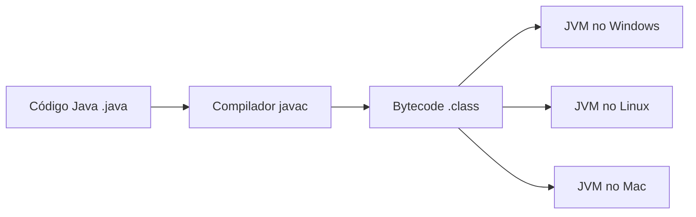

# **WORA em Java - Explicação Detalhada para Iniciantes**

WORA (*Write Once, Run Anywhere*) é um dos conceitos mais fundamentais e poderosos da plataforma Java. Vamos explorar em detalhes o que isso significa e como funciona.

## **O que é WORA?**
WORA significa **"Escreva Uma Vez, Execute em Qualquer Lugar"**. É o princípio que permite que um programa Java seja compilado uma única vez e execute em qualquer dispositivo ou sistema operacional que tenha uma **Java Virtual Machine (JVM)** instalada, sem necessidade de recompilação.

## **Como o WORA funciona?**
O processo envolve 3 etapas principais:

1. **Você escreve o código Java** (arquivo `.java`)
2. **O compilador Java (javac) converte para bytecode** (arquivo `.class`)
3. **A JVM interpreta o bytecode** para a plataforma específica



## **Por que o WORA é importante?**
- ✅ Elimina a necessidade de compilar separadamente para cada sistema
- ✅ Reduz custos de desenvolvimento multiplataforma
- ✅ Simplifica a distribuição de software
- ✅ Mantém consistência de comportamento entre plataformas

## **Exemplo Prático**
Considere este simples programa Java:

```java
public class HelloWorld {
    public static void main(String[] args) {
        System.out.println("Olá, Mundo WORA!");
    }
}
```

O mesmo arquivo `.class` compilado pode executar em:
- Windows (com JVM Windows)
- Linux (com JVM Linux)
- MacOS (com JVM Mac)
- Android (via Dalvik/ART)
- E até em dispositivos embarcados

## **Componentes que tornam o WORA possível**
1. **Bytecode Java**:
   - Formato intermediário neutro
   - Mais compacto que código fonte
   - Otimizado para execução na JVM

2. **Java Virtual Machine (JVM)**:
   - Implementação específica para cada plataforma
   - Responsável pela execução do bytecode
   - Fornece gerenciamento de memória (GC)

3. **Bibliotecas Padrão (Java API)**:
   - Fornecem funcionalidades consistentes
   - Mesmo comportamento em todas as plataformas

## **Limitações do WORA**
Embora poderoso, o WORA tem algumas limitações:
- Diferenças em:
  - Bibliotecas nativas (Java Native Interface - JNI)
  - Sistemas de arquivos (caminhos, permissões)
  - Interfaces gráficas (look-and-feel)
  - Recursos específicos de hardware

## **WORA vs Compilação Nativa**
| Característica | WORA (Java) | Compilação Nativa (C/C++) |
|---------------|------------|--------------------------|
| Portabilidade | Alta (bytecode) | Baixa (binário específico) |
| Performance | Boa (JIT optimization) | Excelente (compilado direto) |
| Dependências | Requer JVM | Auto-contido |
| Tamanho | Bytecode compacto | Binário maior |

## **Exemplo Avançado: WORA na Prática**
Suponha que você desenvolveu um aplicativo de calculadora:

```java
// Calculadora.java
public class Calculadora {
    public static double calcularIMC(double peso, double altura) {
        return peso / (altura * altura);
    }
    
    public static void main(String[] args) {
        System.out.println("Seu IMC é: " + calcularIMC(70, 1.75));
    }
}
```

Este mesmo código pode:
- Rodar em um servidor Linux
- Ser chamado por um app Android
- Executar em um desktop Windows
- Integrar com um sistema MacOS

## **Conclusão**
O WORA é o superpoder do Java que:
- Reduz drasticamente o trabalho multiplataforma
- Mantém consistência de comportamento
- Simplifica a distribuição de software
- Permite que desenvolvedores foquem no código em vez de compatibilidade

É por causa do WORA que Java é amplamente usado em:
- Aplicações empresariais
- Sistemas embarcados
- Desenvolvimento Android
- Computação em nuvem
- Big Data (Hadoop, Spark)

Quer testar o WORA? Compile um programa Java no Windows e tente executá-lo no Linux - você verá o conceito em ação! 🚀