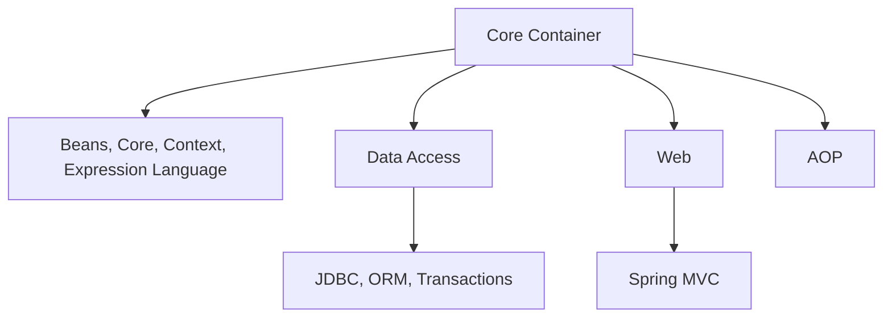
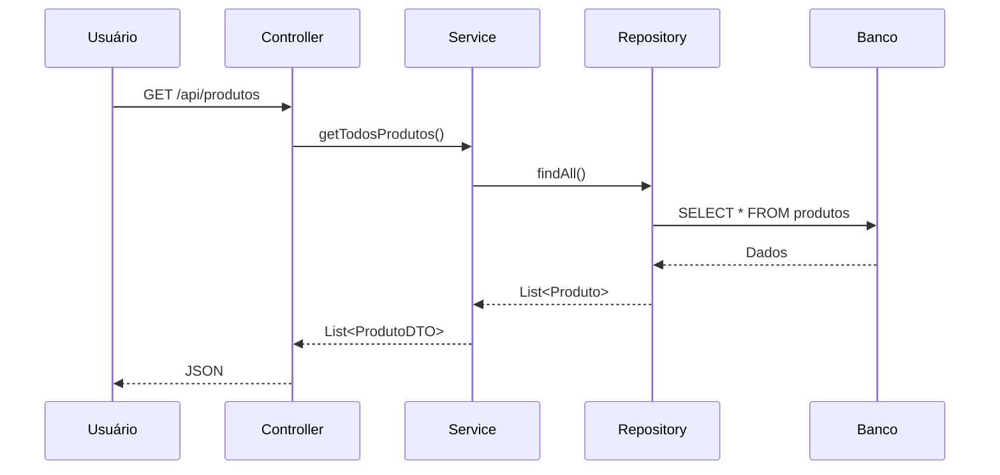

# **Spring e Spring Boot - Guia Completo para Iniciantes em Java**

Spring e Spring Boot são os frameworks mais populares para desenvolvimento Java empresarial. Vamos explorá-los detalhadamente, desde os conceitos básicos até como eles simplificam o desenvolvimento moderno.

## **1. O que é o Spring Framework?**
Spring é um **framework modular** para construção de aplicações Java empresariais, criado para simplificar o desenvolvimento complexo.

### **Principais Características:**
✔️ **Inversão de Controle (IoC)**: O framework gerencia os objetos (beans)  
✔️ **Injeção de Dependência (DI)**: Dependências são automaticamente fornecidas  
✔️ **Programação Orientada a Aspectos (AOP)**: Para cross-cutting concerns como logs e segurança  
✔️ **Módulos Especializados**: Spring MVC, Security, Data, etc.  

### **Arquitetura Básica do Spring:**


## **2. O que é Spring Boot?**
Spring Boot é uma **extensão do Spring** que simplifica ainda mais o desenvolvimento com:

### **Diferenciais do Spring Boot:**
🚀 **Auto-configuração**: Configura automaticamente a aplicação  
📦 **Embedded Server**: Tomcat, Jetty ou Undertow incluídos  
🔧 **Starter POMs**: Dependências pré-configuradas (ex: `spring-boot-starter-web`)  
📊 **Actuator**: Monitoramento e métricas prontos  
📝 **Opinionated Defaults**: Configurações sensíveis por padrão  

## **3. Comparação: Spring vs Spring Boot**

| **Característica**       | **Spring**                  | **Spring Boot**               |
|--------------------------|-----------------------------|--------------------------------|
| Configuração             | Manual (XML/Anotações)      | Automática                     |
| Servidor                 | Externo necessário          | Embedded (incluído)            |
| Dependências             | Definidas manualmente       | Starter POMs                   |
| Tempo de Inicialização   | Mais lento                  | Mais rápido                    |
| Complexidade             | Maior                       | Reduzida                       |
| Melhor para              | Aplicações altamente customizáveis | Microserviços e aplicações rápidas |

## **4. Componentes Principais**

### **Spring Core Concepts**
```java
// Exemplo de Bean gerenciado
@Component
public class MeuServico {
    public String mensagem() {
        return "Olá Spring!";
    }
}

// Injeção de dependência automática
@RestController
public class MeuController {
    
    @Autowired  // Spring injeta automaticamente
    private MeuServico servico;
    
    @GetMapping("/ola")
    public String ola() {
        return servico.mensagem();
    }
}
```

### **Spring Boot Essentials**
```java
// Aplicação Spring Boot mínima
@SpringBootApplication
public class MinhaApp {
    public static void main(String[] args) {
        SpringApplication.run(MinhaApp.class, args);
    }
}

// Controller REST com Spring Boot
@RestController
@RequestMapping("/api")
public class ApiController {
    
    @GetMapping("/hello")
    public String hello() {
        return "Hello Spring Boot!";
    }
}
```

## **5. Fluxo de uma Aplicação Spring Boot**



## **6. Principais Módulos do Ecossistema Spring**

### **Spring Core**
- **Beans**: Gerenciamento de objetos
- **Context**: Configuração da aplicação
- **Core**: Funcionalidades fundamentais

### **Spring MVC**
- Para aplicações web tradicionais
- `@Controller`, `@RequestMapping`

### **Spring Data**
```java
public interface ProdutoRepository extends JpaRepository<Produto, Long> {
    List<Produto> findByNomeContaining(String nome);
}
```

### **Spring Security**
```java
@Configuration
@EnableWebSecurity
public class SecurityConfig extends WebSecurityConfigurerAdapter {
    @Override
    protected void configure(HttpSecurity http) throws Exception {
        http.authorizeRequests()
            .antMatchers("/admin/**").hasRole("ADMIN")
            .anyRequest().authenticated()
            .and()
            .formLogin();
    }
}
```

### **Spring Boot Actuator**
- Endpoints de monitoramento:
  - `/actuator/health`
  - `/actuator/metrics`
  - `/actuator/env`

## **7. Como Começar com Spring Boot**

### **Passo 1: Crie um projeto**
Use [start.spring.io](https://start.spring.io/) com:
- Spring Web
- Spring Data JPA
- H2 Database (para desenvolvimento)

### **Passo 2: Estrutura Básica**
```
src/
├── main/
│   ├── java/
│   │   └── com/
│   │       └── exemplo/
│   │           ├── MinhaApp.java
│   │           ├── controller/
│   │           ├── model/
│   │           ├── repository/
│   │           └── service/
│   └── resources/
│       ├── application.properties
│       └── static/
└── test/
```

### **Passo 3: Configure o application.properties**
```properties
# Configuração do H2
spring.datasource.url=jdbc:h2:mem:testdb
spring.datasource.driverClassName=org.h2.Driver
spring.h2.console.enabled=true

# Atuador
management.endpoints.web.exposure.include=*
```

## **8. Exemplo Completo: API REST com Spring Boot**

```java
// Entidade JPA
@Entity
public class Produto {
    @Id
    @GeneratedValue
    private Long id;
    private String nome;
    private Double preco;
    // getters/setters
}

// Repositório Spring Data
public interface ProdutoRepository extends JpaRepository<Produto, Long> {
}

// Camada de Serviço
@Service
public class ProdutoService {
    @Autowired
    private ProdutoRepository repository;
    
    public List<Produto> listarTodos() {
        return repository.findAll();
    }
}

// Controller REST
@RestController
@RequestMapping("/produtos")
public class ProdutoController {
    
    @Autowired
    private ProdutoService service;
    
    @GetMapping
    public ResponseEntity<List<Produto>> listar() {
        return ResponseEntity.ok(service.listarTodos());
    }
}
```

## **9. Boas Práticas com Spring/Spring Boot**

1. **Organização em Camadas**:
   - Controller → Service → Repository → Model

2. **Tratamento de Exceções**:
   ```java
   @ControllerAdvice
   public class GlobalExceptionHandler {
       @ExceptionHandler(ResourceNotFoundException.class)
       public ResponseEntity<?> handleNotFound() {
           return ResponseEntity.notFound().build();
       }
   }
   ```

3. **DTOs para APIs**:
   ```java
   public class ProdutoDTO {
       private String nome;
       private String precoFormatado;
       // getters/setters
   }
   ```

4. **Testes Automatizados**:
   ```java
   @SpringBootTest
   class ProdutoServiceTest {
       @Autowired
       private ProdutoService service;
       
       @Test
       void quandoListarTodos_entaoRetornarLista() {
           assertFalse(service.listarTodos().isEmpty());
       }
   }
   ```

## **10. Quando Usar Spring vs Spring Boot?**

**Use Spring tradicional quando:**
- Precisa de controle total sobre a configuração
- Está migrando uma aplicação legada
- Requer integrações muito específicas

**Prefira Spring Boot para:**
- Iniciar novos projetos rapidamente
- Desenvolver microserviços
- Quando quer produtividade com convenções sensíveis

## **Conclusão**
Spring Boot revolucionou o desenvolvimento Java ao:
✔️ Eliminar configurações repetitivas  
✔️ Oferecer servidores embutidos  
✔️ Simplificar o deployment  
✔️ Prover ótimos padrões desde o início  

Para começar hoje mesmo:
1. Acesse [start.spring.io](https://start.spring.io/)
2. Escolha suas dependências
3. Baixe o projeto e execute:
```bash
mvn spring-boot:run
``` 

O ecossistema Spring continua evoluindo, com projetos como Spring Cloud para microserviços e Spring Native para compilação nativa, mantendo o Java relevante na era moderna.